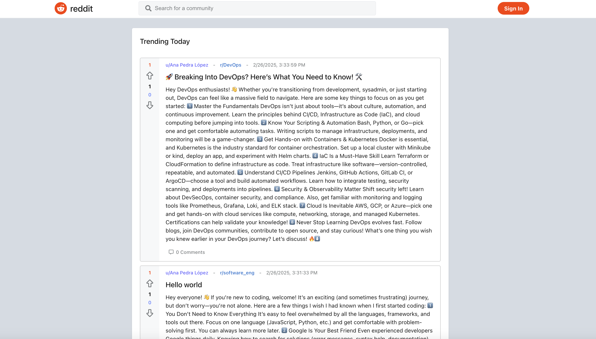
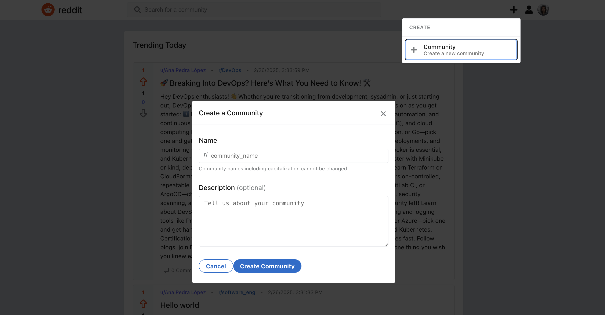
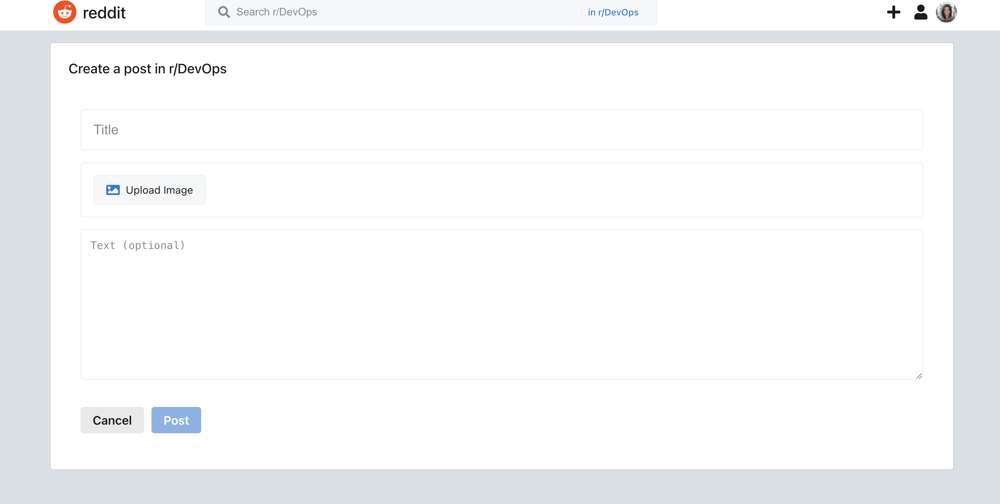

# 🚀 Reddit Clone

A Reddit-inspired web application built with TypeScript, React, and Convex.

# 🌟 Tech Stack

- Frontend: TypeScript, React
- Backend: Convex
- Build Tool: Vite

# 🎯 Live Demo

**[Reddit Clone - Live App](https://reddit-psi-six.vercel.app/)**

# 📸 Screenshots

🏠 Home Page

🔥 Trending Posts

📝 Post Creation

# ⚡ React + TypeScript + Vite

This template provides a minimal setup to get React working in Vite with HMR and some ESLint rules.
